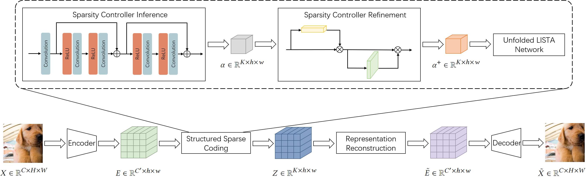

# SSC-VAE: Structured Sparse Coding based Variational Autoencoder

**Structured Sparse Coding based Variational Autoencoder for Details Preserved Image Reconstruction**



### Directory Structure

```txt
├── assets
│   └── SSCVAE.png
│
├── configs
│   ├── *.json
│
├── models.py
├── utils.py
├── visualization.py
│
├── train_recon_*.py
├── train_denoise_*.py
├── test_recon_*.py
├── test_denoise_*.py
│
├── scripts
│   ├── compute_avg.py
│   └── filter_model.py
│
├── README.md
└── requirements.txt
```

### Quick Start

##### 1. Installation

```shell
pip install -r requirements.txt
```

##### 2. Configuration

The json file consists of four sections: `data`, `model`, `train`, and `test`.

To use the `ultrasound` dataset, use the following configuration:
```json
"data": {
    "dataset": "ultrasound",
    "root_dir": "./dataset",
    "quality": "high_quality",
    "seed": 1,
    "train_ratio": 0.8,
    "val_ratio": 0.1,
    "batch_size": 16,
    "sigma": 10
}
```

To use the `BSDS500` dataset, use the following configuration:
```json
"data": {
    "dataset": "gray",
    "root_dir": "./gray",
    "seed": 1,
    "train_ratio": 0.8,
    "val_ratio": 0.1,
    "patch_size": 256,
    "stride_size": 32,
    "batch_size": 16,
    "sigma": 10
}
```

To use the `mini-Imagenet` dataset, use the following configuration:
```json
"data": {
    "dataset": "imagenet",
    "root_dir": "./imagenet",
    "patch_size": 256,
    "stride_size": 128,
    "batch_size": 16,
    "sigma": 10
}
```

To use the `SSCVAE` or `SCVAE` model, use the following configuration:
```json
"model": {
    "in_channels": 1,
    "hid_channels_1": 128,
    "hid_channels_2": 512,
    "out_channels": 256,
    "down_samples": 3,
    "num_groups": 16,
    "num_atoms": 512,
    "num_dims": 256,
    "num_iters": 16
}
```

To use the `VQVAE` model, use the following configuration:
```json
"model": {
    "in_channels": 1,
    "hid_channels_1": 128,
    "hid_channels_2": 512,
    "out_channels": 256,
    "down_samples": 3,
    "num_groups": 16,
    "num_atoms": 512,
    "num_dims": 256,
    "beta": 0.25
}
```

To set the training and testing, use the following configuration:
```json
"train": {
    "lr": 1e-4,
    "epochs": 200,
    "save_frequency": 1,
    "save_path": "./results/vqvae_recon_gray"
},
"test": {
    "model_id": 0
}
```

##### 3. Run the training code

(Taking the example of conducting reconstruction experiment using the SSCVAE model on the ultrasound dataset)

```shell
python train_recon_sscvae.py -c configs/sscvae_recon_ultrasound.json
```

##### 4. Run the testing code

(Taking the example of conducting reconstruction experiment using the SSCVAE model on the ultrasound dataset)

Execute the following command to obtain the IDs of the top 5 performing models on the validation set:
```shell
python scripts/filter_model.py -c configs/sscvae_recon_ultrasound.json
```

Write the ID of the first model into the `model_id` field of the `sscvae_recon_ultrasound.json` file.

To perform model testing, execute the following command:
```shell
python test_recon_sscvae.py -c configs/sscvae_recon_ultrasound.json
```

To compute the average value of the metrics, execute the following command:
```shell
python scripts/compute_avg.py -c configs/sscvae_recon_ultrasound.json
```

To compute the FID (Fréchet Inception Distance) metric, execute the following command:
```shell
python -m pytorch_fid path/to/input/images path/to/output/images
```

### Reference

- https://github.com/AntixK/PyTorch-VAE/blob/master/models/vq_vae.py